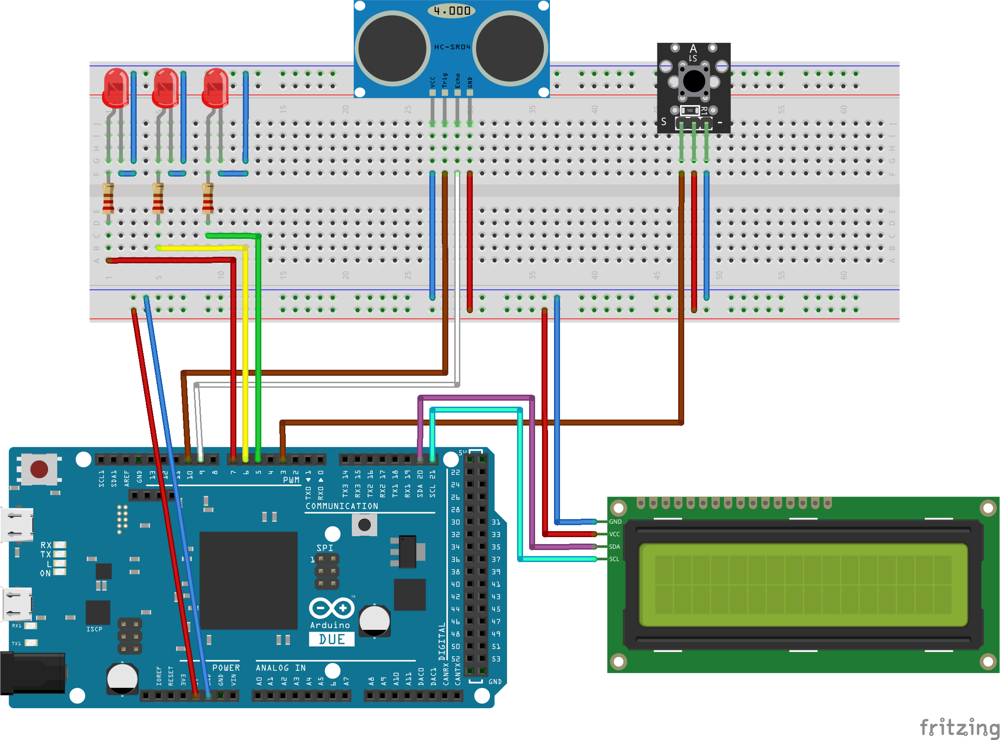
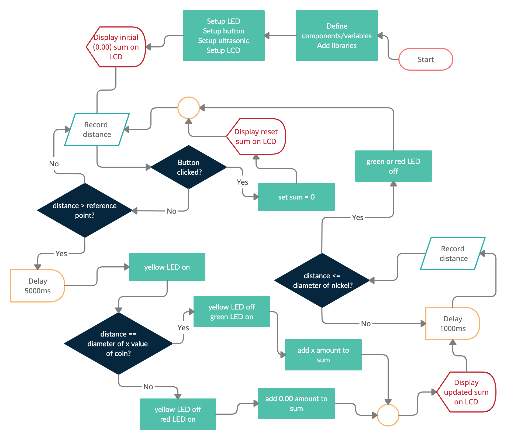

# Coin-Reader
## Inspiration
Payment systems play an important role in today's society. Without them, it would render common systems such as vending machines and parking meters useless. I wanted to take an approach that would identify currencies using their size. Download the [report here](https://github.com/BallenAlain/Coin-Reader/blob/main/Report/Technical-Report.pdf).

## What it is
The Coin Reader is a device that identifies the value of coins through measuring its diameter. 

## Diagrams

## How it works
This project utilized an HC-SR04 ultrasonic sensor used in conjunction with a mechanical mechanism measures the displacement of the reference object when an inserted coin pushes against the mechanism. A coin is identified if the distance displaced is equal to the diameter of the inserted coin.

## References

- S. (2020, July 28). Arduino Coin Sorter and Counter. The
Engineering Minds. https://www.theengineeringminds.com/arduino-coin-sorter-and-counter/

- D. (2021, February 5). Ultrasonic Sensor HC-SR04 and
Arduino Tutorial. HowToMechatronics. https://howtomechatronics.com/tutorials/arduino/ultrasonic-sensorhc-sr04/

- Dubey, A. (2020, August 22). How to improve readings of
Ultrasonic Sensor - Temperature and Humidity
Compensation. NerdyElectronics. https://nerdyelectronics.com/embedded-systems/sensors/ how-to-improve-readingsof-ultrasonic-sensor-temperature-and-humiditycompensation/

- Fmalpartida. (2020, November 24). New-LiquidCrystal.
GitHub Repository, https://github.com/fmalpartida/NewLiquidCrystal